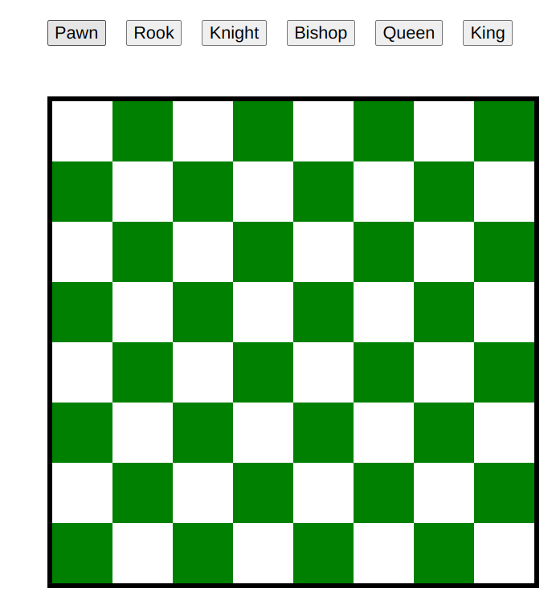
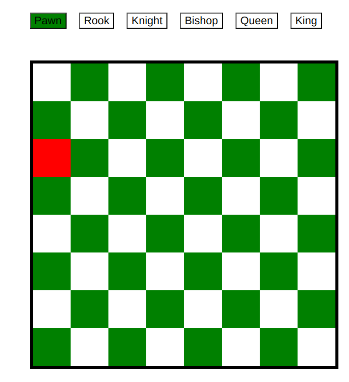

# ♟️ Chessboard Simulation

A simple and interactive chessboard simulation built using **HTML**, **CSS**, and **JavaScript**. This project visually renders an 8x8 chessboard with alternating black and white squares — just like a real chessboard.

---

## 🚀 Features

- Alternating color pattern (black and white squares)
- Simple and lightweight — no external libraries
- Can be extended with chess piece logic or moves

---

## 🛠️ Tech Stack

- **HTML5** – Structure of the board  
- **CSS3** – Styling the board and squares  
- **JavaScript** – Dynamic generation of the board (if applicable)

---

## 📸 Preview
* Plain chess board image
  

* Pawn moves

